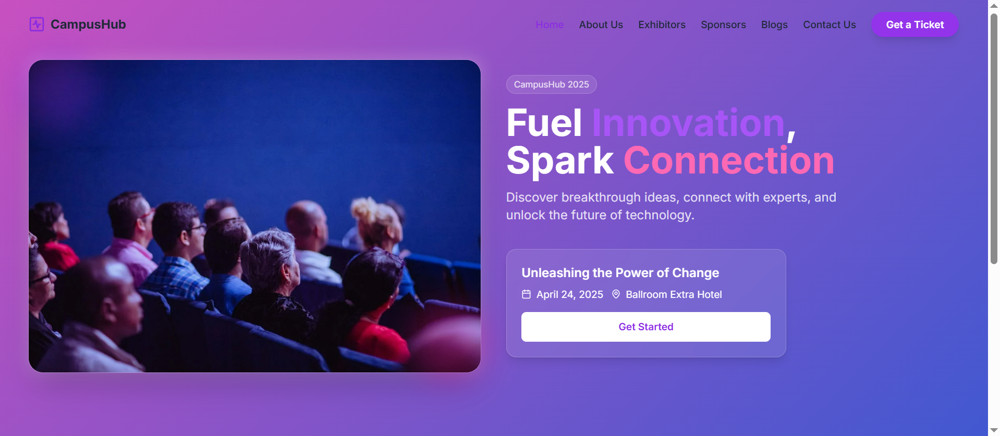
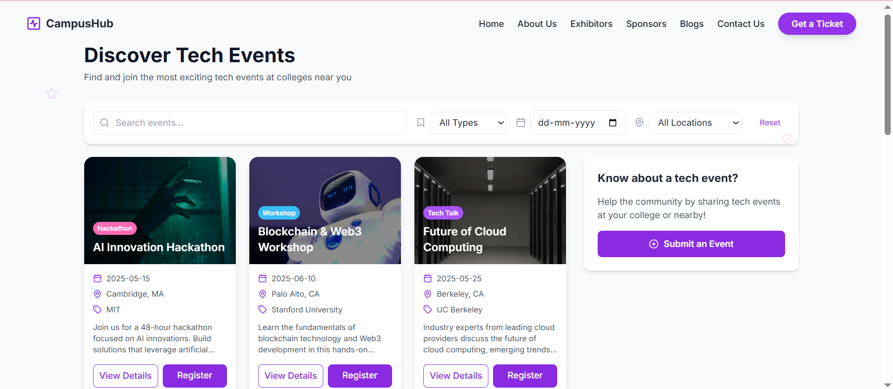
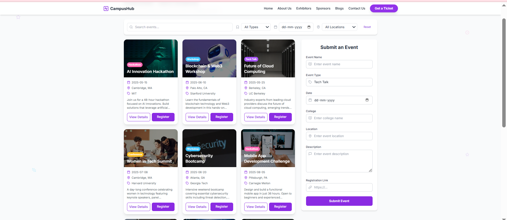
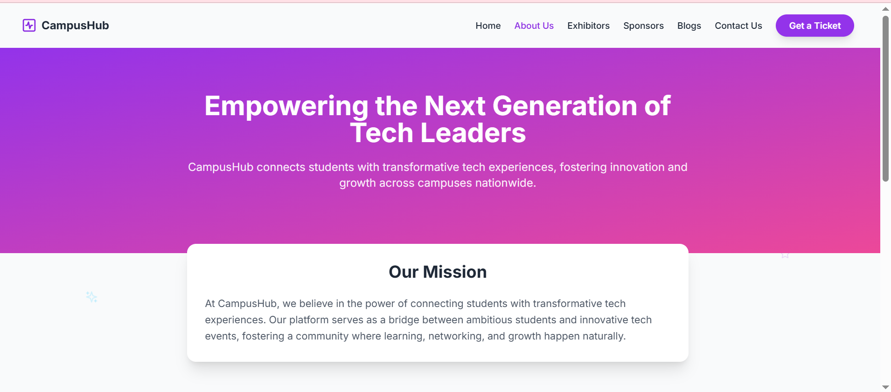
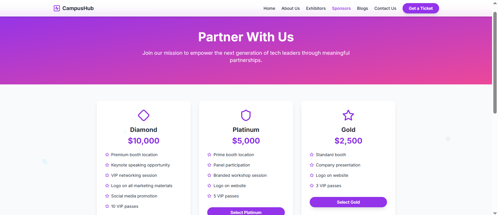

# 🌐 CampusHub – Your College Tech Event Companion

🚀 [Live Site →](https://campushubby.netlify.app/)

CampusHub is a sleek and intuitive Web2 platform that helps students **discover and promote college tech events**—including hackathons, workshops, and tech talks. Developed for the **Devdock.ai Week 5 Challenge**, this app demonstrates front-end/backend integration with clean design, scalability, and a focus on user experience.

---

## 🧠 Built For

> 🎯 **Devdock.ai Week 5 Challenge – Web2 Event Aggregator App**

This submission includes full functionality with a hosted live link, GitHub source, and screenshots showing:
- Code enhancement practices
- UI components
- Form validation
- State management
- Clean file structure for scalability

---

## 🖥️ Features

### ✅ Homepage (Landing Page)
- ✨ Modern Hero Section: *"Fuel Innovation, Spark Connection"*
- 🎯 Featured Event Highlight Card
- 🔗 "Get Started" CTA → Events Page
- 🔒 Trusted By section with organization logos (mocked)

---

### 📅 Event Dashboard
- 📌 Displays all upcoming events
- 🔍 **Filter Events** by:
  - Type (Hackathon, Workshop, Tech Talk)
  - Date Range
  - College Name
  - Location
- 📘 Detailed Event View includes:
  - Description
  - Date & Time
  - Registration link
  - College & Location

---

### 📝 Submit Your Event
- Users can submit new events via form
- Required fields:
  - Event Name, Type, Date
  - College, Location
  - Description, Registration Link
- Form includes validation and stores data in **MongoDB backend**

---

## 💡 Enhancements for Code Quality using devdock.ai
> Attached screenshots show how I improved code quality through:

- ✅ Modular and reusable React components (`EventCard`, `Navbar`, `Filter`)
- ✅ Type safety using **TypeScript**
- ✅ Folder-level separation (`components`, `pages`, `services`)
- ✅ Clean commits and version control via Git
- ✅ ESLint integration for consistent coding standards
- ✅ Fully responsive with **TailwindCSS**

📸 Screenshots of enhancements using devdock.ai

---

## 🧪 Mock Data
- App includes 10+ dummy events simulating real college events
- Structure mirrors scraped data from college websites

---

## 📸 App Screenshots

### Main Section  

### Event Dashboard  

### Event Submission  

### About Page  

### Blog Page  

### Contact Page  

---

## 🧑‍💻 Author

- 👩‍💻 [Swetha Ganesh](https://github.com/swethaganeshh)

---

## 📬 Feedback & Suggestions

Have feedback or want to suggest improvements?
- Open an issue on [GitHub](https://github.com/swethaganeshh/CampusHub)
- Or connect on LinkedIn (if you'd like to add)

---

